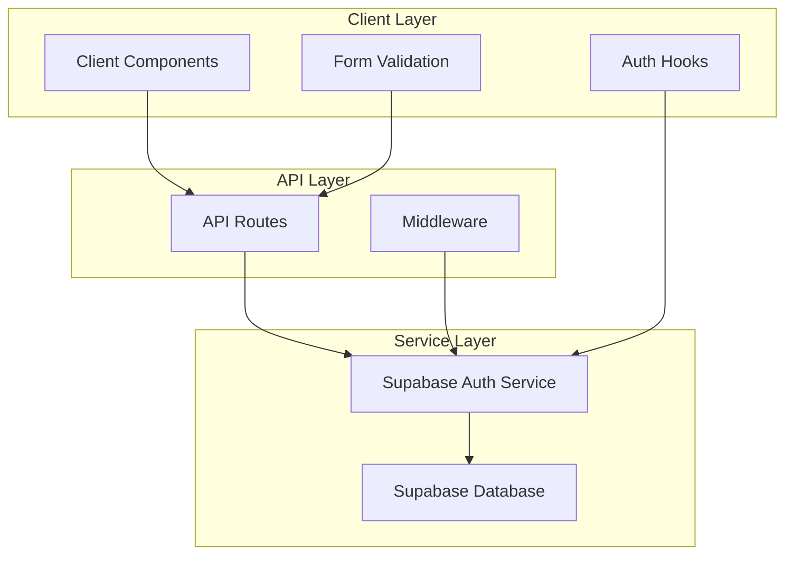

# Design Document

## Overview

This design document outlines the implementation of a comprehensive authentication system using Supabase for a Next.js tourism application. The system will provide secure user registration, login, password reset functionality, and session management without relying on third-party OAuth providers. The design builds upon the existing Supabase infrastructure and enhances it with proper error handling, validation, and user experience improvements.

## Architecture

The authentication system follows a layered architecture pattern:



### Key Architectural Principles

1. **Separation of Concerns**: Clear separation between UI components, API logic, and authentication services
2. **Server-Side Rendering**: Leveraging Next.js SSR capabilities with Supabase SSR package
3. **Security First**: All authentication operations handled server-side with proper validation
4. **Progressive Enhancement**: Client-side validation with server-side enforcement

## Components and Interfaces

### Core Components

#### 1. Authentication API Routes
- `/api/auth/register` - User registration endpoint
- `/api/auth/login` - User login endpoint  
- `/api/auth/logout` - User logout endpoint
- `/api/auth/forgot-password` - Password reset request endpoint
- `/api/auth/reset-password` - Password reset confirmation endpoint

#### 2. Client Components
- `LoginPage` - Enhanced login form with validation
- `RegisterPage` - Enhanced registration form with validation
- `ForgotPasswordPage` - Password reset request form
- `ResetPasswordPage` - Password reset confirmation form

#### 3. Authentication Utilities
- `authAPI` - Client-side API wrapper functions
- `useAuth` - Enhanced authentication hook
- `useUser` - User state management hook

#### 4. Middleware
- Route protection middleware for authenticated routes
- Session validation and refresh logic

### Interface Definitions

```typescript
interface User {
  id: string
  email: string
  firstName?: string
  lastName?: string
  emailConfirmed: boolean
  createdAt: string
}

interface AuthState {
  user: User | null
  loading: boolean
  error: string | null
}

interface LoginCredentials {
  email: string
  password: string
}

interface RegisterData {
  email: string
  password: string
  firstName: string
  lastName: string
}

interface PasswordResetRequest {
  email: string
}

interface PasswordResetConfirmation {
  token: string
  password: string
}
```

## Data Models

### User Profile Data
The system will utilize Supabase's built-in user authentication with additional metadata:

```sql
-- Supabase auth.users table (managed by Supabase)
-- Additional user metadata stored in user_metadata JSONB field:
{
  "first_name": "string",
  "last_name": "string"
}
```

### Session Management
- Sessions managed entirely by Supabase Auth
- JWT tokens stored in HTTP-only cookies
- Automatic token refresh handled by Supabase client

### Password Reset Tokens
- Secure tokens generated by Supabase Auth
- Time-limited (configurable, default 1 hour)
- Single-use tokens that expire after successful reset

## Error Handling

### Client-Side Error Handling
- Form validation errors displayed inline
- Network errors shown with retry options
- Loading states during authentication operations
- Success feedback for completed operations

### Server-Side Error Handling
- Comprehensive input validation
- Sanitized error messages (no sensitive information exposure)
- Proper HTTP status codes
- Structured error responses

### Error Categories
1. **Validation Errors** (400): Invalid input format, missing fields
2. **Authentication Errors** (401): Invalid credentials, unconfirmed email
3. **Authorization Errors** (403): Account locked, insufficient permissions
4. **Rate Limiting** (429): Too many requests
5. **Server Errors** (500): Database connection, internal errors

## Testing Strategy

The testing approach combines unit testing for individual components and property-based testing for universal authentication behaviors.

### Unit Testing
- API route handlers with various input scenarios
- Form validation logic
- Authentication utility functions
- Error handling paths
- UI component rendering and interactions

### Property-Based Testing
Property-based tests will use **fast-check** library for JavaScript/TypeScript to verify universal properties across many inputs. Each property-based test will run a minimum of 100 iterations to ensure comprehensive coverage.

Property-based tests will be tagged with comments referencing the specific correctness property from this design document using the format: `**Feature: supabase-authentication, Property {number}: {property_text}**`

### Integration Testing
- End-to-end authentication flows
- Session persistence across page refreshes
- Route protection functionality
- Password reset email delivery (in test environment)

## Correctness Properties

*A property is a characteristic or behavior that should hold true across all valid executions of a system-essentially, a formal statement about what the system should do. Properties serve as the bridge between human-readable specifications and machine-verifiable correctness guarantees.*

Based on the prework analysis, I'll consolidate related properties to eliminate redundancy and create comprehensive correctness properties:

**Property Reflection:**
- Properties 1.1, 1.4, and 1.5 can be combined into a comprehensive registration flow property
- Properties 2.1, 2.4, and 2.5 can be combined into a comprehensive login flow property  
- Properties 3.1, 3.2, and 3.5 can be combined into a comprehensive password reset flow property
- Properties 4.1, 4.2, and 4.3 can be combined into a comprehensive logout flow property
- Properties 5.1 and 5.2 can be combined into a comprehensive validation property
- Properties 6.1, 6.2, and 6.4 can be combined into a comprehensive route protection property

### Consolidated Correctness Properties

**Property 1: Registration Flow Integrity**
*For any* valid user registration data, the complete registration process should create a user account, send a confirmation email, and upon email confirmation, activate the account for login
**Validates: Requirements 1.1, 1.4, 1.5**

**Property 2: Duplicate Registration Prevention**
*For any* email address that already exists in the system, registration attempts should be rejected with appropriate error messaging
**Validates: Requirements 1.2**

**Property 3: Input Validation Consistency**
*For any* invalid email format or weak password, both client-side and server-side validation should reject the input and provide specific, actionable feedback
**Validates: Requirements 1.3, 5.1, 5.2**

**Property 4: Login Flow Integrity**
*For any* valid user credentials, the login process should authenticate the user, create a persistent session, and redirect to the appropriate page
**Validates: Requirements 2.1, 2.4, 2.5**

**Property 5: Invalid Login Rejection**
*For any* incorrect credentials or unconfirmed accounts, login attempts should be rejected with security-appropriate error messages
**Validates: Requirements 2.2, 2.3**

**Property 6: Password Reset Flow Integrity**
*For any* valid email address, the password reset process should generate a secure token, send reset email, validate the token, allow password change, and invalidate existing sessions
**Validates: Requirements 3.1, 3.2, 3.5**

**Property 7: Token Expiration Enforcement**
*For any* expired password reset token, reset attempts should be rejected and require new token generation
**Validates: Requirements 3.3**

**Property 8: Password Strength Enforcement**
*For any* password change attempt, the system should enforce strength requirements and reject weak passwords
**Validates: Requirements 3.4**

**Property 9: Logout Flow Integrity**
*For any* authenticated user, the logout process should terminate the session, clear authentication tokens, and redirect to the login page
**Validates: Requirements 4.1, 4.2, 4.3**

**Property 10: Route Protection Consistency**
*For any* unauthenticated user or expired session, access to protected routes should be prevented with redirection to login and proper session cleanup
**Validates: Requirements 4.4, 6.1, 6.2**

**Property 11: Error Handling Robustness**
*For any* network error or rate limiting scenario, the system should handle failures gracefully and provide clear user feedback
**Validates: Requirements 5.3, 5.4**

**Property 12: Success Feedback Consistency**
*For any* completed authentication operation, the system should provide clear success feedback to users
**Validates: Requirements 5.5**

**Property 13: Session State Synchronization**
*For any* authentication state change, the UI should update consistently across all components and session information should remain consistent
**Validates: Requirements 6.3, 6.5**

**Property 14: Application Initialization Integrity**
*For any* application load, the system should check for existing valid sessions and restore user state appropriately
**Validates: Requirements 6.4**